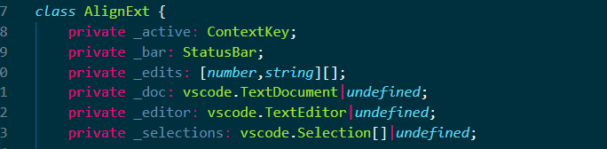
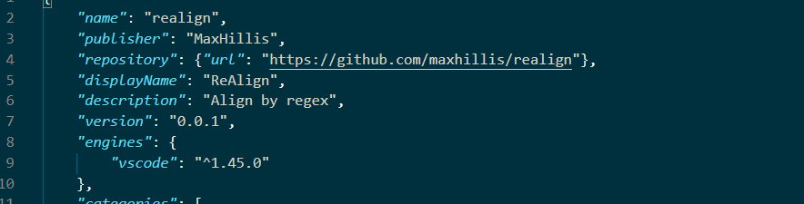
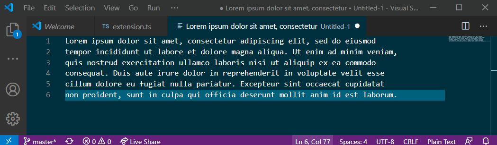
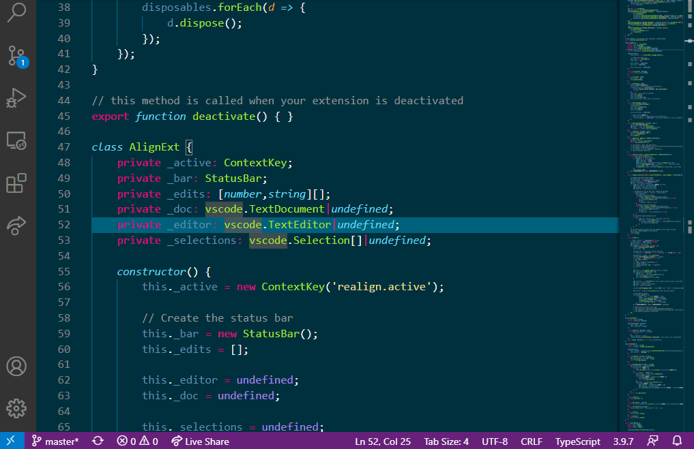

# ReAlign README

Align code by regex!

Based roughly on the amazing Sublime extension AlignTab that I miss dearly.  
Find it here: https://github.com/randy3k/AlignTab

## Features

- Align by user defined regex that doesn't block your code!

- Auto expand to applicable lines!

- Select the exact lines and limit the number of columns to align!

- Wildcard matches

## Extension Commands

| Command            | Description    |
|--------------------|----------------|
| `realign.activate` | Start Aligning |
| `Enter`            | Confirm input  |
| `Esc`              | Cancel input   |

## Basic Usage

To start aligning move your cursor to a block of code you wish to align. Then activate the extension (I use Alt+A) and type the pattern to align on.

Confirm your alignment with `Enter` and cancel it with `Escape`.

To limit the lines that get aligned simply highlight the lines you wish to include.

## Advanced usage

In addition to your regex you can enter advanced options by entering
input in the form of [regex]/[options].

Add padding using options `l`, `r`, or `c`
* `/lN` adds N spaces to left of the regex matches 
* `/rN` adds N spaces to right of the regex matches 
* `/cN` adds N spaces to left and right of the regex matches 
* `/lNrM` adds N left and M right

Limit the number of times per line you match using `f`
* `/fN` limits each line to N matches

### Examples

* `:` would match every colon
* `:/f2` would match the first 2 colons
* `:/l3f2` would match the first 2 colons and add 3 spaces to their left

## Known Issues

We shall find out.

## Release Notes

Initial release

### 1.0.0

Initial release of ReAlign

-----------------------------------------------------------------------------------------------------------